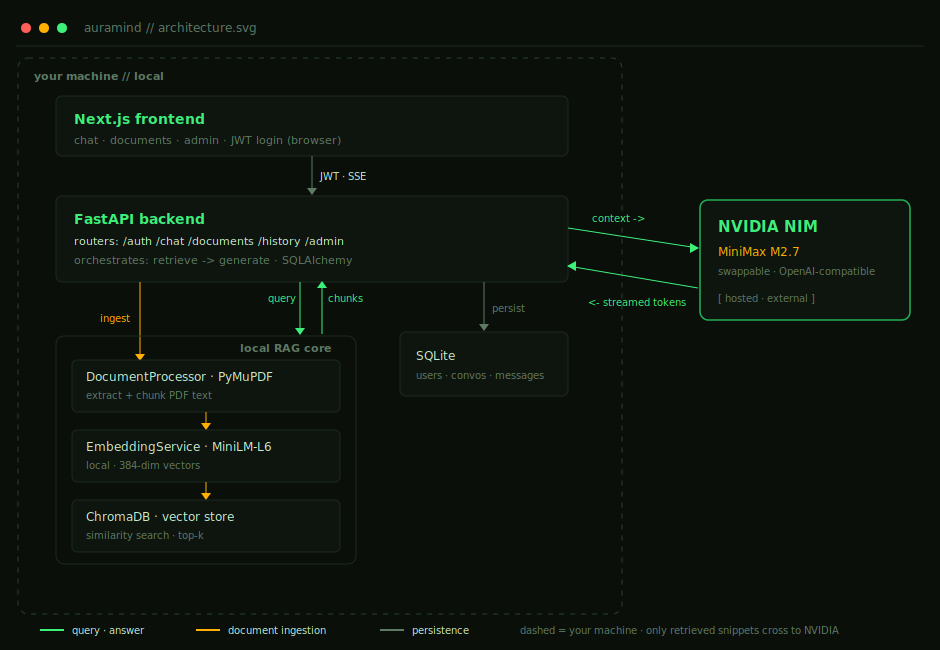

# AuraMind — Internal AI Knowledge Assistant

AuraMind is a Retrieval-Augmented Generation (RAG) platform for secure internal documentation analysis. Built with Next.js and FastAPI, it embeds your documents **locally** and streams grounded, cited answers in real time. Embeddings and the vector store never leave your machine; answer generation is delegated to a hosted engine (NVIDIA NIM) — or, optionally, a fully-local Ollama setup.



## 🚀 Key Features

- **Local Embeddings**: Documents are embedded on-device with `SentenceTransformers` (`all-MiniLM-L6-v2`) — embedding never touches the network.
- **Real-Time Streaming**: Answers stream word-by-word over Server-Sent Events (SSE).
- **Grounded & Cited**: Answers are restricted to retrieved context and cite the source document and page.
- **Swappable Engine**: Generation runs on NVIDIA NIM (MiniMax M2.7 by default; switch to Kimi K2.6 with one env var) — or point it at a local Ollama install instead.
- **Persistent Memory**: Full chat history and conversation management with SQLite.
- **Secure Access**: JWT authentication, bcrypt-hashed credentials, and role-based admin.

## 🧠 How It Works

```
PDF → chunk → embed (local MiniLM) → ChromaDB → retrieve top-k → NVIDIA NIM (MiniMax M2.7) → streamed answer + citations
```

Only the small set of retrieved chunks needed to answer a question is sent to the generation engine. The corpus, its embeddings, and the vector store stay on your machine. Run with `LLM_PROVIDER=ollama` if you need generation on-premises too.

## 🛠️ Tech Stack

- **Frontend**: Next.js 16 (App Router), Tailwind CSS v4, Framer Motion, Lucide React.
- **Backend**: FastAPI (Python), SQLAlchemy, Pydantic.
- **Vector Engine**: ChromaDB with local `all-MiniLM-L6-v2` embeddings (384-dim).
- **Generation**: NVIDIA NIM (`minimax-m2.7`, swappable) over an OpenAI-compatible API. Optional local Ollama fallback.
- **Security**: JWT authentication, bcrypt password hashing.

## 📦 Installation & Setup

### 1. Prerequisites
- Python 3.10+
- Node.js 18+
- An NVIDIA NIM API key — free at [build.nvidia.com](https://build.nvidia.com/settings/api-keys)
  - *Optional:* install [Ollama](https://ollama.com/) instead and set `LLM_PROVIDER=ollama`.

### 2. Backend Setup
```bash
cd backend
python -m venv venv
venv\Scripts\activate           # Windows  (macOS/Linux: source venv/bin/activate)
pip install -r requirements.txt
cp .env.example .env            # Windows: copy .env.example .env
#   then edit .env → set SECRET_KEY and NVIDIA_API_KEY
uvicorn main:app --reload
```

### 3. Frontend Setup
```bash
cd frontend
npm install
npm run dev
```

Open http://localhost:3000, register (the **first** account becomes admin), upload a PDF, and start asking.

### Switching the model
The engine is config-only — no code changes:
```env
NVIDIA_MODEL=minimaxai/minimax-m2.7   # default; or moonshotai/kimi-k2.6
# LLM_PROVIDER=ollama                  # run generation fully local instead
```

## 🛡️ Design Notes
- **Async I/O**: Non-blocking database access and streaming generation.
- **Local embeddings, hosted generation**: Your corpus is embedded locally; only retrieved snippets reach the generation engine. Switch to Ollama for fully on-prem inference.
- **Grounded answers**: The model is instructed to answer only from retrieved context and to cite its sources.

## 📄 License
MIT License. Created by Adithya as a case study in advanced RAG architecture.
